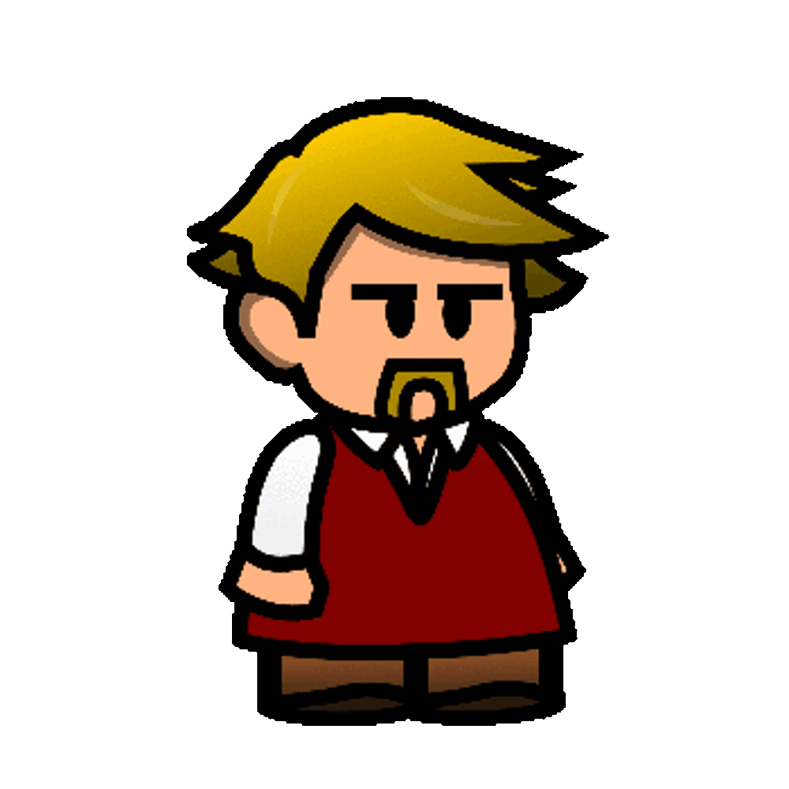
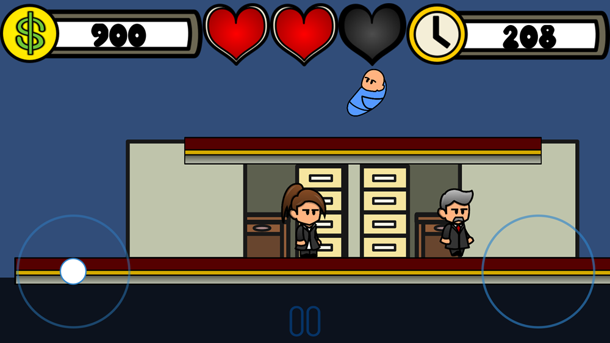

# The Daily Grind
.png)

## Description
A game developed as part of the final output of a Gender & Sexuality research project during my undergrad at the University of Utah.
Was previously released on Android via the Google Play Store (https://play.google.com/store/apps/details?id=com.ChrisCarlson.TheDailyGrind) but is no longer maintained.
Developed in a two-week time period using Unity3D.

Credits:
- Character art & animations created by Chris Carlson.
- Engineering & Gameplay Systems created by Chris Carlson.
- Other assets provided by freegameassets and freesounds

## Overview
Intended to be a very blunt illustration of gaps in gender equality within the workplace based on studies reviewed during the course, the game had a few main mechanics.

### Character Selection
The player could pick either a male or female character. 

If they chose male, they would encounter a much easier game, with normal money (score) scaling, non-aggressive enemies, and a much easier level design.

If they chose female however, enemies would aggro, high scores were much harder to reach, there was less time to complete a much more difficult level, and other penalty item pickups were frequent.

.png)

### NPC Characters
There were two main NPC's.

#### Boss-man McGhee
Would be highly aggressive towards the female character, chasing the player until they got out of range.

.gif)

#### Deadline Bo(m)b
Would begin ticking down once you were within a certain range and then explode, hurting the player and launch them in the air, often causing the player to fall off the map and fail the level.

## Gameplay Example

